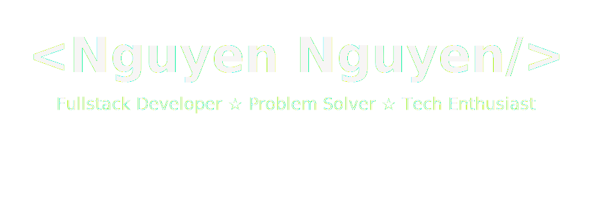

<div align="center">

<!-- Animated Header with Gradient -->


<!-- Typing Animation -->
<a href="https://git.io/typing-svg">
  
</a>

<!-- Social Badges with Hover Effect -->
<p align="center">
  <a href="https://www.linkedin.com/in/nguyentrung918">
    
  </a>
  <a href="https://github.com/NguyenNguyen0">
    
  </a>
  <a href="https://leetcode.com/nguyentrung918">
    
  </a>
  
</p>

</div>

---

## 🚀 About Me

<!--  -->


```javascript
const nguyen = {
    location: "Ho Chi Minh City, Vietnam 🇻🇳",
    role: "Fullstack Developer",
    currentFocus: "Building scalable web applications",
    languages: ["Python", "JavaScript", "TypeScript"],
    frameworks: ["ReactJS", "Next.js", "FastAPI"],
    interests: ["Web Development", "AI/ML", "Problem Solving"],
    motto: "Code with passion, build with purpose 💡"
};
```

<br clear="right"/>

### 💫 What I Do

- 🔭 Currently working on **AI-powered web applications**
- 🌱 Learning **Go** and exploring **Cloud Architecture**
- 👯 Looking to collaborate on **open-source projects**
- 💬 Ask me about **React, Python, FastAPI, or System Design**
- ⚡ Fun fact: I solve coding challenges for breakfast! 🍳

---

## 🛠️ Tech Arsenal

<div align="center">

### Languages & Core
<p>
  
</p>

### Frontend Development
<p>
  
</p>

### Backend & Databases
<p>
  
</p>

### DevOps & Tools
<p>
  
</p>

</div>

---

## 🎯 Featured Projects

<div align="center">

### 🤖 AI Chatbot Platform
<p>
  <a href="https://github.com/NguyenNguyen0/chatbot-fe">
    
  </a>
  <a href="https://github.com/NguyenNguyen0/chatbot-be">
    
  </a>
</p>

**Tech Stack:** React • FastAPI • Ollama • TailwindCSS
<br>
*Intelligent chatbot with natural language processing capabilities*

---

### 🖼️ Modern Album Manager
<p>
  <a href="https://github.com/NguyenNguyen0/album-fe">
    
  </a>
  <a href="https://github.com/NguyenNguyen0/album-be">
    
  </a>
</p>

**Tech Stack:** Next.js • Node.js • MongoDB • TailwindCSS
<br>
*Beautiful and responsive photo album management system*

---

### 🧑 Developer Portfolio
<p>
  <a href="https://github.com/NguyenNguyen0/my-portfolio">
    
  </a>
</p>

**Tech Stack:** Next.js • TailwindCSS • Framer Motion
<br>
*Personal portfolio showcasing projects and skills*

---

### 💸 Bill Calculator CLI
<p>
  <a href="https://github.com/NguyenNguyen0/bill-calculator">
    
  </a>
</p>

**Tech Stack:** Python • CLI
<br>
*Efficient utility bill calculation tool*

</div>

---

## 📊 GitHub Analytics

<div align="center">
  


<!-- Activity Graph -->


</div>

---

## 🏆 GitHub Trophies

<div align="center">
  


</div>

---

## 💭 Dev Quote

<div align="center">


</div>

---

## 🎵 Currently Vibing To

<div align="center">

[](https://spotify-github-profile.kittinanx.com/api/view?uid=31n5uje7hfsknauf3wkfglkktyly&redirect=true)
</div>

---

<div align="center">

### 💬 Let's Connect!

**I'm always open to interesting conversations and collaboration opportunities.**

<p>
  <a href="mailto:your.email@example.com">
    
  </a>
  <!-- <a href="https://twitter.com/yourusername">
    
  </a> -->
</p>

### ⭐️ From [NguyenNguyen0](https://github.com/NguyenNguyen0) with 💙


</div>
