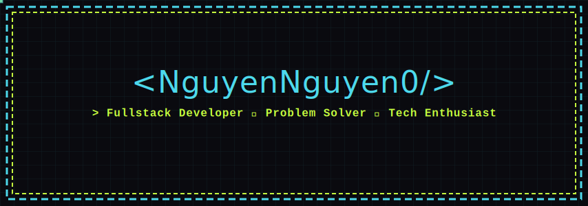

<!-- Animated Header with Gradient -->

<!-- Typing Animation -->

<!-- Social Badges with Hover Effect -->

  
  
  
  

---

## 🚀 About Me

<table width="100%">
<tr>
<td valign="top" width="50%">

#### 📋 Profile

- 📍 Based in **Ho Chi Minh City, Vietnam** 🇻🇳
- 💼 Role: **Fullstack Developer**
- 🎯 Focus: **Building scalable web applications**
- 🧠 Languages: `Python` `Java` `TypeScript`
- 🧩 Frameworks: `Spring` `Next.js` `FastAPI`
- ❤️ Motto: *Code with passion, build with purpose*

 

</td>
<td valign="top" width="50%">

#### 💫 What I Do

- 🔭 Currently working on **AI-powered web applications**
- 🌱 Learning **Go** and exploring **Cloud Architecture**
- 👯 Looking to collaborate on **open-source projects**
- 💬 Ask me about **React, Spring, FastAPI, or System Design**
- ⚡ Fun fact: I solve coding challenges for breakfast!

 

</td>
</tr>
</table>

---

## 🛠️ Tech Arsenal

<table width="100%">
<tr>
<td align="center" valign="top" width="50%">

#### 💻 Languages & Core

    

</td>
<td align="center" valign="top" width="50%">

#### 🎨 Frontend Development

       

</td>
</tr>
<tr>
<td align="center" valign="top" width="50%">

#### ⚙️ Backend & Databases

             

</td>
<td align="center" valign="top" width="50%">

#### 🛠️ DevOps & Tools

            

</td>
</tr>
</table>

---

## 📊 GitHub Analytics

  

<!-- Activity Graph -->

---

## 🏆 GitHub Trophies

  

---

### 💬 Let's Connect!

**I'm always open to interesting conversations and collaboration opportunities.**

  
  <!--  -->

### ⭐️ From [NguyenNguyen0](https://github.com/NguyenNguyen0) with 💙

